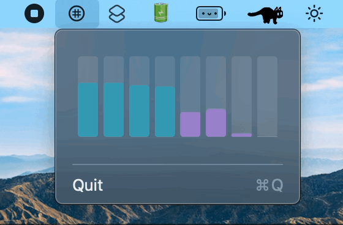

# Gaufre

    

Gaufre🧇 is the app for checking load of each core of CPU on your Mac menu bar.

The application name was decided to be [Gaufre](https://www.kobe-fugetsudo.co.jp/sweets/gaufres.html), derived from silicon "wafer".

    

## Dependencies

- Xcode 13.1+
- macOS 11+

## Swift Package Dependencies

- [CoreWafer](https://github.com/Shakshi3104/CoreWafer)
    - [ProcessorKit](https://github.com/Shakshi3104/ProcessorKit)
    - [DeviceHardware](https://github.com/Shakshi3104/DeviceHardware)
